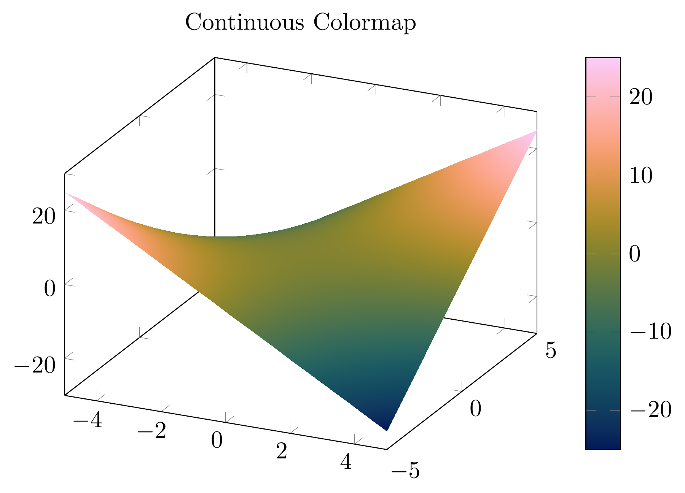
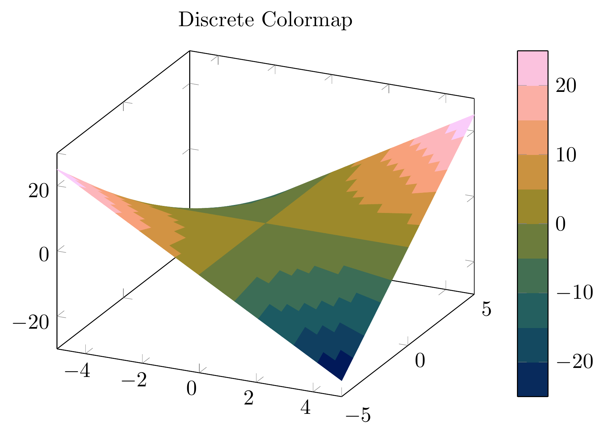
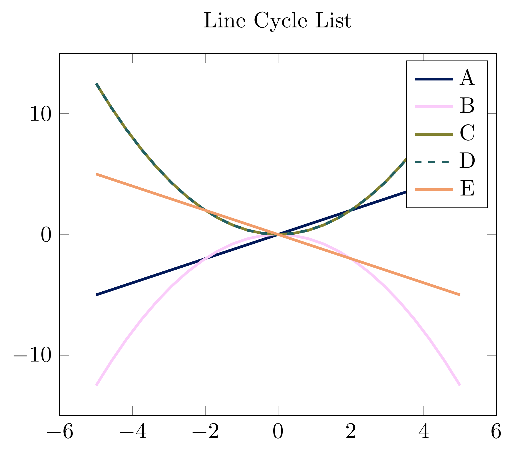
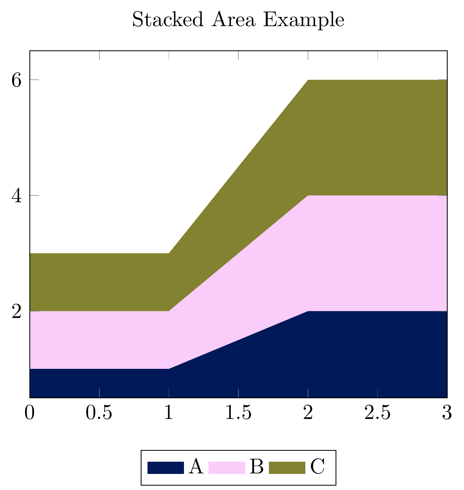
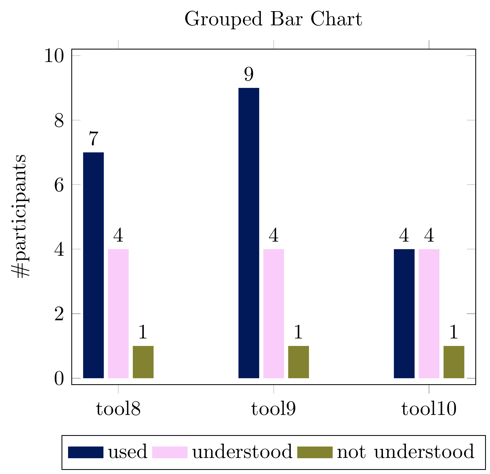

# tikzScientificColormaps

PGFplots-compatible colormap packages generated from
[Fabio Crameri's Scientific Colour Maps](https://www.fabiocrameri.ch/colourmaps/).

All credit for the colour design belongs to Fabio Crameri.
This repository only provides the tooling to translate his data into LaTeX/TikZ format.

## Prerequisites

**Python** (≥ 3.8)
```
pip install -r requirements.txt   # installs numpy
```

**LaTeX**: a distribution that includes `pgfplots` and `xcolor`
(e.g. TeX Live, MiKTeX, MacTeX).

## Workflow

The full pipeline consists of four steps:

### 1. Download the upstream source data

```bash
make download
```

This fetches `ScientificColourMaps8.zip` from Zenodo
([DOI 10.5281/zenodo.8409685](https://doi.org/10.5281/zenodo.8409685))
and extracts it into `ScientificColourMaps8/`.
The source data is intentionally **not** committed to this repository.

### 2. Generate the LaTeX style files

```bash
make generate
# or manually:
python translate_colormaps.py
```

This reads every colormap directory under `ScientificColourMaps8/` and writes
the corresponding `.sty` file into `ScientificColourMapsTikz/`.

### 3. Install the style files

Copy (or symlink) the generated `.sty` files and `arealegendstyle.sty` into
your local `texmf` tree:

```bash
cp ScientificColourMapsTikz/*.sty arealegendstyle.sty ~/texmf/tex/latex/colormaps/
```

### 4. Use in LaTeX

```latex
\usepackage{ScientificColourMapsTikz/batlow}   % during development
% or, after installing:
\usepackage{batlow}
```

See `test.tex` for a full working example including surface plots, discrete
colormaps, line cycle lists, stacked area charts, and grouped bar charts.

## Preview

The images below are generated from separate pages of `test.tex`, which serves
both as the example document and as the source for these README preview assets.

<p>
	
	
	
	
	
</p>

## Available colormaps

| Type | Names |
|---|---|
| Sequential | acton, bamako, batlow, batlowK, batlowW, bilbao, buda, davos, devon, glasgow, grayC, hawaii, imola, lajolla, lapaz, lipari, navia, naviaW, nuuk, oslo, tokyo, turku |
| Diverging | bam, berlin, broc, cork, lisbon, managua, roma, tofino, vik |
| Multi-sequential | bukavu, fes, oleron, vanimo |

Each colormap provides:
- **Continuous** variant: `batlow`
- **Discrete** variants (if available): `batlow10`, `batlow25`, `batlow50`, `batlow100`
- **Categorical** cycle lists (if available): `\pgfplotscreateplotcyclelist{batlow}{…}`

> **Note on "O" variants** (`bamO`, `brocO`, `corkO`, `romaO`, `vikO`):
> These are cyclic/omnidirectional versions of diverging maps. They are
> present in the upstream data but intentionally excluded from generation
> because PGFplots handles cyclic colormaps differently and their inclusion
> would require separate handling. Add `--include-cyclic` to the script if
> you need them.

## Version

| Component | Version | Date |
|---|---|---|
| This repository | v1.0.0 | 2026-04-12 |
| Scientific Colour Maps | 8.0.1 | 2023-10-05 |
| Zenodo DOI | [10.5281/zenodo.8409685](https://doi.org/10.5281/zenodo.8409685) | |

Release bundles (generated `.sty` files and preview assets) are published on
[GitHub Releases](https://github.com/hortulanusT/pgfplotsScientificColormaps/releases).
Use tags in the format `scm-vX.Y.Z` (for example `scm-v8.0.1`) to trigger
the release workflow.

## License

The translation tooling in this repository is released under the
[MIT License](LICENSE).

The Scientific Colour Maps data by Fabio Crameri are also MIT-licensed.
See [doi.org/10.5281/zenodo.1243862](https://doi.org/10.5281/zenodo.1243862)
for the full terms.

Please cite Crameri's work when using these colormaps in publications:

> Crameri, F. (2023). Scientific colour maps (8.0.1). Zenodo.
> https://doi.org/10.5281/zenodo.8409685